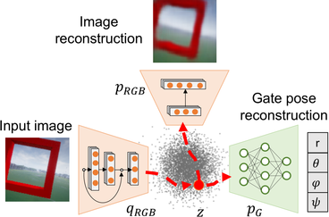
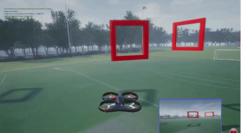

# Learning Controls Using Cross-Modal Representations: Bridging Simulation and Reality for Drone Racing


This repository provides a code base to evaluate and train models from the paper "*Learning Controls Using Cross-Modal Representations: Bridging Simulation and Reality for Drone Racing*". The original paper and video can be found in the following links:

Paper: [https://arxiv.org/abs/1909.06993](https://arxiv.org/abs/1909.06993)

Video: [https://youtu.be/aSugOL0qI44](https://youtu.be/aSugOL0qI44)

## License and Citation
This project is licensed under the terms of the MIT license. By using the software, you are agreeing to the terms of the [license agreement](LICENSE).

If you use this code in your research, please cite us as follows:

```
@article{bonatti2019learning,
  title={Learning Controls Using Cross-Modal Representations: Bridging Simulation and Reality for Drone Racing},
  author={Bonatti, Rogerio and Madaan, Ratnesh and Vineet, Vibhav and Scherer, Sebastian and Kapoor, Ashish},
  journal={arXiv preprint arXiv:1909.06993},
  year={2019}
}
```

## Recommended system
Recommended system (tested):
- Ubuntu 18.04
- Python 2.7.15

Python packages used by the example provided and their recommended version:
- tensorflow==2.0.0-beta1
- msgpack-rpc-python==0.4.1
- numpy==1.16.4
- matplotlib==2.1.1
- scikit-learn==0.20.4
- scipy==1.2.2
- pandas==0.24.2

## Downloading the drone racing files
In order for you to train the models and run Airsim you first need to download all image datasets, behavior cloning datasets, network weights and Airsim binaries:  
- Download all files and datasets [Drone Racing files v. 1.0](https://drive.google.com/drive/folders/19tFUG8bCg3_d_PeQMDHJQvj-ZBv8Ogs_?usp=sharing)
- Extract all individual files in the folders
- Place the 'settings.json' file inside '~/Documents/AirSim' in your computer

## Training and testing the cross-modal VAE representation
In order to train the cross-modal representations you can either use the downloaded image dataset from the previous step, or generate the data yourself using Airsim.



### Training with downloaded dataset

- Go to folder 'cmvae', and inside file 'train_cmvae.py' edit variable 'data_dir' to the correct path of the extracted dataset within your computer. The default value is the directory with 1K images. But for final training you will need more images, such as the 50K or 300K datasets
- Also, edit variable 'output_dir' to the correct place where you want the models to be saved 
- Run

```
train_cmvae.py
```

- Network weights will be saved every 5 epochs by default, and you can check loss values with tensorboard or by looking at the terminal
- Once the network is trained you can evaluate it using another script, which will automatically plot histograms of errors, image reconstructions and latent space interpolations:
```
eval_cmvae.py
```

### Generating your own dataset with Airsim
You may want to generate a custom dataset for training you cross-modal VAE. Here are the steps to do it:

- Start the Airsim environment from the binary file:
```
$ cd /yourpath/all_files/airsim_binaries/vae_env
$ ./AirSimExe.sh -windowed
```
- If it asks if you want the car model, click 'No'
- Inside the file 'datagen/img_generator/main.py' first change the desired number of samples and saved dataset path
- Run the script for generating data:
```
main.py     # inside datagen/img_generator
```
- Once the dataset is generated, follow the previous scripts for training the CM-VAE


## Generating imitation learning data for racing
In order to train the behavior cloning networks you can either use the downloaded image-action pairs dataset or generate the data yourself using Airsim.

### Training with downloaded dataset

- Go to folder 'imitation_learning', and inside file 'train_bc.py' edit variables 'base_path', 'data_dir_list', and 'output_dir'. By default you will be using downloaded datasets with  0m to 3m of random gate displacement amplitude over a course with 8m of nominal radius
- Edit the variables relative to the training mode (full end-to-end, latent representation or regression as latent representation) and weights path for the latent representations (not applicable for full end-to-end learning)
- Run the script for training the behavior cloning policies:
```
train_bc.py
```

### Generating your own imitation learning dataset with Airsim
You may want to generate a custom dataset for training you behavior cloning policies. Here are the steps to do it:

- Start the Airsim environment from the binary file (not the same one for generating images for the cross-modal representation!):
```
$ cd /yourpath/all_files/airsim_binaries/recording_env
$ ./AirSimExe.sh -windowed
```
- Inside the file 'datagen/action_generator/src/soccer_datagen.py' change the desired meta-parameters (number of gates, track radius, gate displacement noise, etc)
- Run the script for generating data:
```
soccer_datagen.py
```
- Once you're satisfied with the motion, turn off trajectory visualization parameter 'viz_traj'. Otherwise the recorded images will show the motion line
- Once the quad is flying, press 'r' on your keyboard to start recording images. Velocities will be automatically recorded. Both are saved inside '~/Documents/AirSim'

Now you'll need to process the raw recording so that you can match the time-stamps from velocity commands and images into a cohesive dataset. To do it:

- Inside '~/Documents/AirSim', copy the contents of both folders ('moveOnSpline_vel_cmd.txt', 'images' folder and 'images.txt' file) into a new directory, for example '~/all_files/il_datasets/bc_test'.
- In 'datagen/action_generator/src/data_processor.py', modify variable 'base_path' to '~/all_files/il_datasets/bc_test'. Then run:
```
data_processor.py
```
- Finally, can train 'train_bc.py' following the previous steps. You can combine different datasets with different noise levels to train the same policy 

## Deploying the trained policies
Now you can deploy the trained policies in AirSim, following these steps:
- Start the Airsim environment from correct binary file:
```
$ cd /yourpath/all_files/airsim_binaries/vae_env
$ ./AirSimExe.sh -windowed
```
- In file 'imitation_learning/bc_navigation.py', modify 'policy_type' and 'gate_noise'. Then run:
```
bc_navigation.py
```

